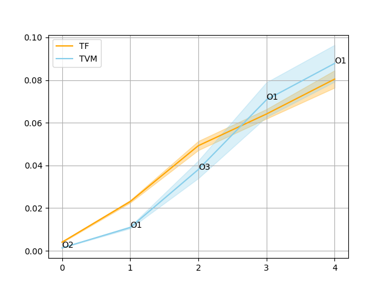

TODO
====

* ~~Run `run` several times?~~
* ~~Try with default NNVM optimisations disabled~~
* Measure all possible times (Wall time, CPU time, etc)
* Figure out parallelism. Which module does schedule parallel execution in TVM?
* Try with batch size ~100?
* Compare TF/TVM performance on different segments of the Model.

Problems
========

* Simple TF runners use `session.run` which may be slow, try feeders.
* TV/TVM error correlates with absolute input value, setup relative tolerance.

LOG
===

#### 04.10.2018
* Fixed error in TF code of `block1` (sqrt`->`rsqrt). Now results are equal
  with absoulte tolerance of 1e-5.

#### 01.10.2018
* Manually encoding TF-version of block between `Rcnn_ctcV3/expand_conv1/add_1`
  and `Rcnn_ctcV3/conv_block1/unit1/add_2/add` nodes. Its name is `block`.
* Strange difference in results between TF and TVM version of block1.

#### 27.09.2018
* Finished writing staging code, obtain Model sources in NNVM DSL, do some
  tests.
* Plan `partsearch` experiment which would measure the performance of the Model
  running from the same input node to different output nodes.

* Main experiment results are on image above.
  Points on Y-axis are execution times in seconds.
  Points on X-axis correspond to the folowing nodes:

  - 0: `Rcnn_ctcV3/expand_conv1/add_1/add`
  - 1: `Rcnn_ctcV3/expand_conv2/add_7/add`
  - 2: `Rcnn_ctcV3/expand_conv3/add_13/add`
  - 3: `Rcnn_ctcV3/expand_conv4/add_17/add`
  - 4: `Rcnn_ctcV3/conv2d_116/BiasAdd`

  One can see that TVM is faster on smaller parts of the model, but performance
  seems to degrade on larger parts.
* Decided to measure the performance of specific parts of the Model taking
  different input nodes. We will call them `blocks`.

#### 13.09.2018
* Measured the performance of the Model using TVM and Tensorflow.
  TF shows better results.
* Decided to measure the performance on a specific model parts. Unfortunately,
  TVM doesn't provide access to intermediated blocks of imported models.
* Started the implementation of staging module able to produce the NNVM DSL code
  during TF importing

#### 01.09.2018
* Obtained `RCNN_ctcV3` model

